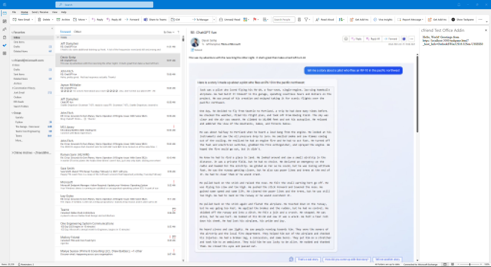

## Proof-of-Concept: Webassembly .NET Outlook Add-in

This repo is a simple demonstration of an Outlook web add-in running .NET code inside Webassembly. This could
prove useful for maintainers of old .NET COM add-ins looking to port to Web. 

Components of the repo:
* .NET WASM project (outlook_poc_2.csproj)
* Node server for static files

### Requirements

* Outlook 2016 or greater
* [.NET 7 RC1 SDK](https://dotnet.microsoft.com/en-us/download/dotnet/7.0) or later
* Node/npm
* .NET WASM tools workload: `dotnet workload install wasm-tools`

### Getting Started

From src/outlook-addin, Build the .NET component and start the web server.

```
cd src/outlook-addin
npm run build:dotnet ; npm install
npm run serve
```

In a separate terminal, sideload the addin with Outlook:

```
npm run start:desktop
```

Outlook should open, and a "Show Taskpane" button should appear in the ribbon.


